# TrackPro

TrackPro is an open-source mobile app that grants automotive enthusiasts, racers, and anyone looking to enhance their driving experience—with real-time performance stats.

TrackPro, combined with any ESP32 or ESP8266 MCU and a GPS module, allows users to accurately measure and analyze their driving behavior.
The communication works with Wi-Fi using TCP for getting the best and most reliable results.

<table>
  <tr>
    <td align="center">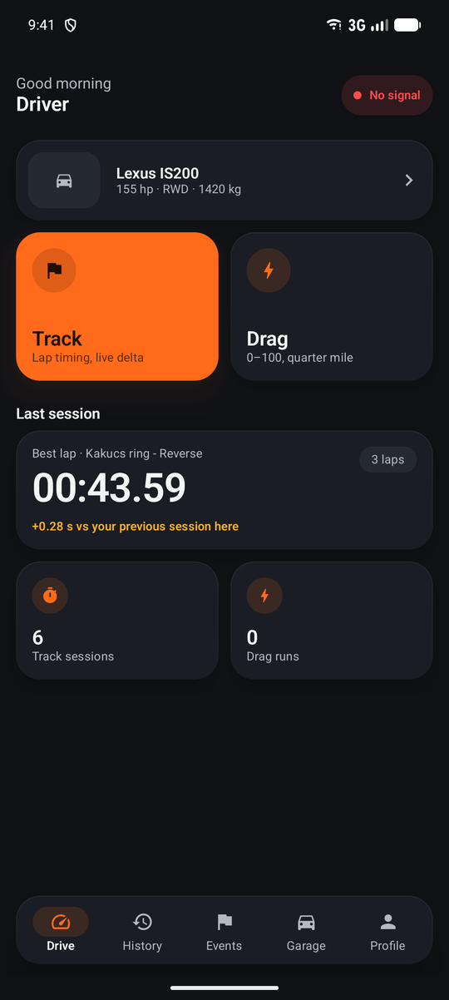 Drive</td>
    <td align="center">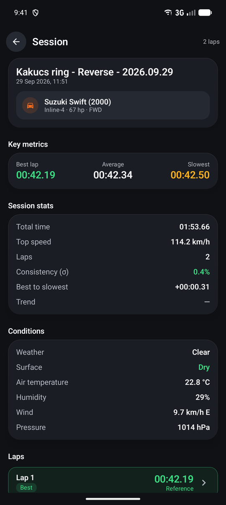 Session summary</td>
    <td align="center">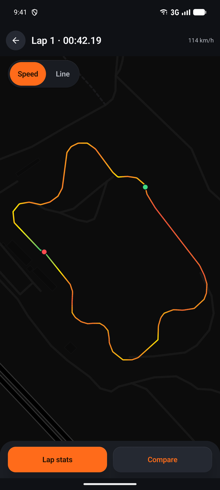 Lap speed map</td>
    <td align="center">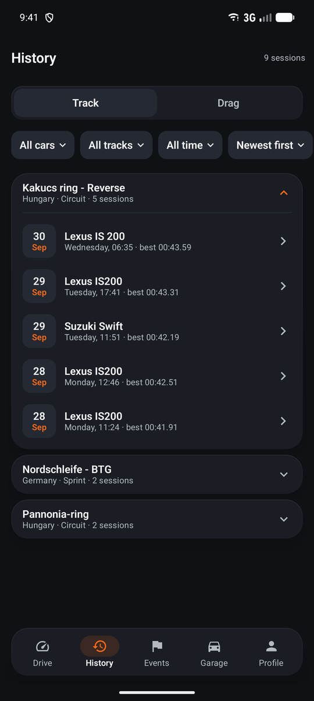 History</td>
  </tr>
  <tr>
    <td align="center">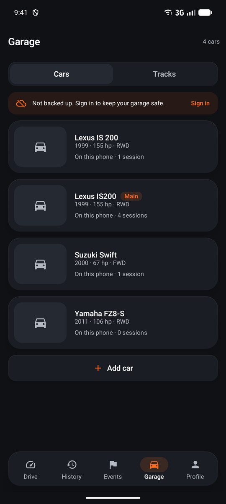 Garage</td>
    <td align="center">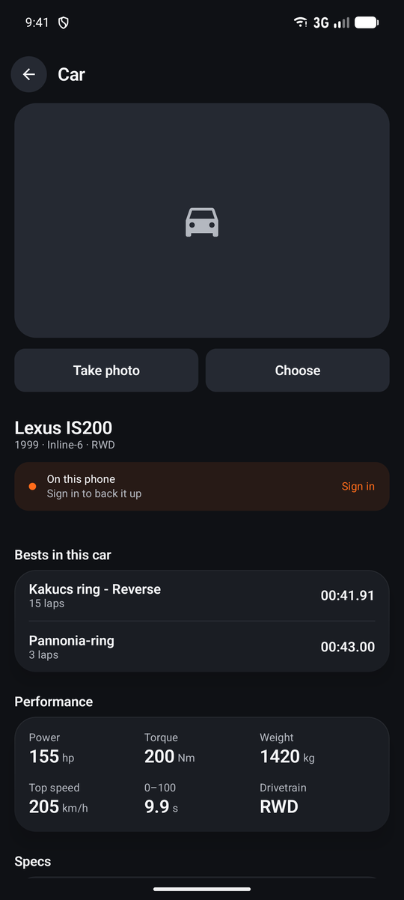 Car</td>
    <td align="center">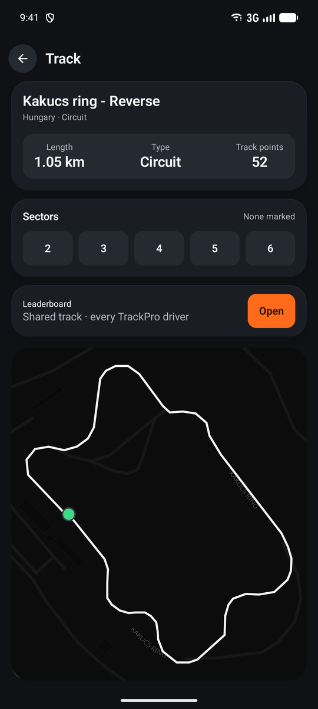 Track</td>
    <td align="center">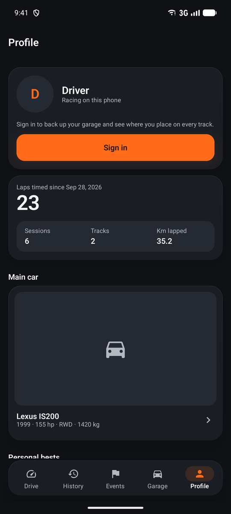 Profile</td>
  </tr>
</table>

Key Features:
- Lap Timing: Measures lap times for circuit racing, karting, or track days.

- Track builder: make your own track, store it and mesure your speed and times
  
- Drag Timer: ¼-mile, 0-60 mph / 0-100Kmh or other custom drag race metrics
  
- Acceleration Analysis: Analyze acceleration data over time as well as distance for per
formance evaluation.
  
- Breaking Stats: Track and review braking efficiency and metrics such as stopping distance and deceleration rates.

- Add your vehicle: Save your car, bike or other vehicle and give their stats and use them sessions

Future plans:
- Live sharing
- Online leaderboard
- Data-to-video
- Checkpoint time stat / sprint race

Main menu:

GPS Connection testing:
  This page is responsible for testing the connection between the ESP's Wifi and the Application.
  The proper software and hardware is required for the ESP whic can be found here: https://github.com/Aredarn/TrackPro_ESP
  The following can be seen if the connection is successful and the ESP's GPS has position lock.
    - Latitude
    - Longitude
    - Altitude (In meters)
    - Satellites
    - Speed (in kilometer/hour)
    - Timestamp

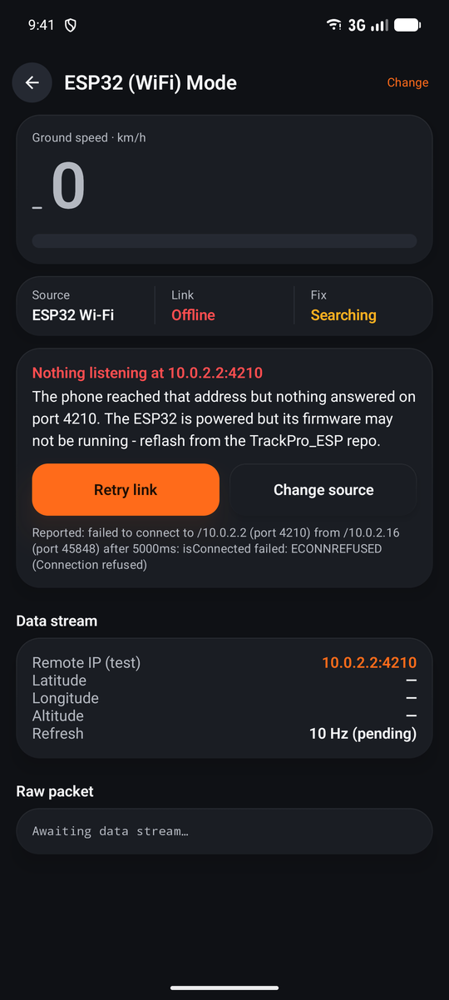

Add your own car:

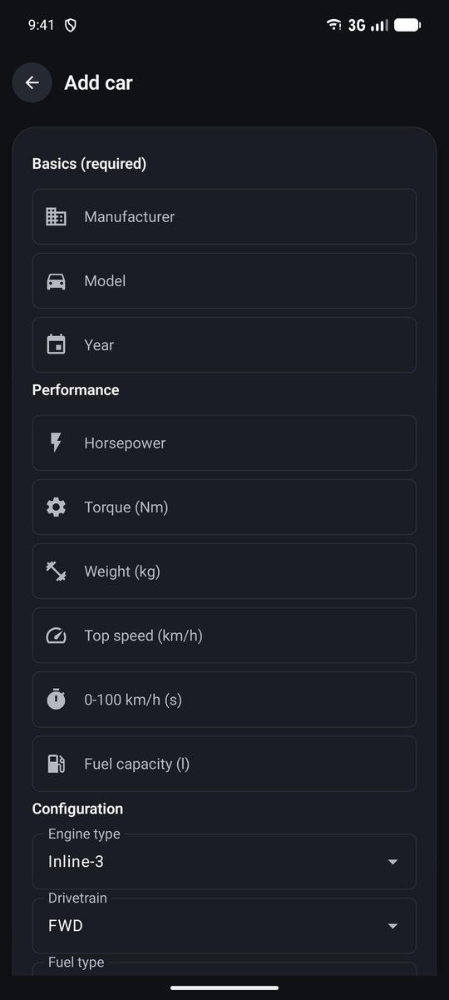

Drag-time screen:

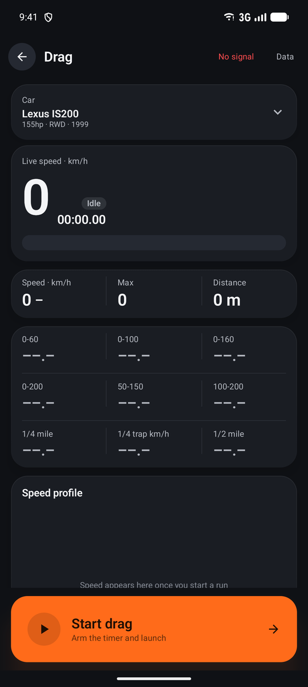

Lap timer screen:

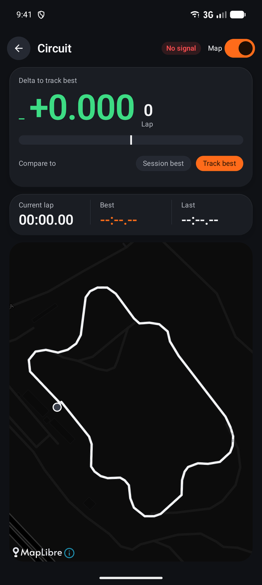

Lap builder screen:

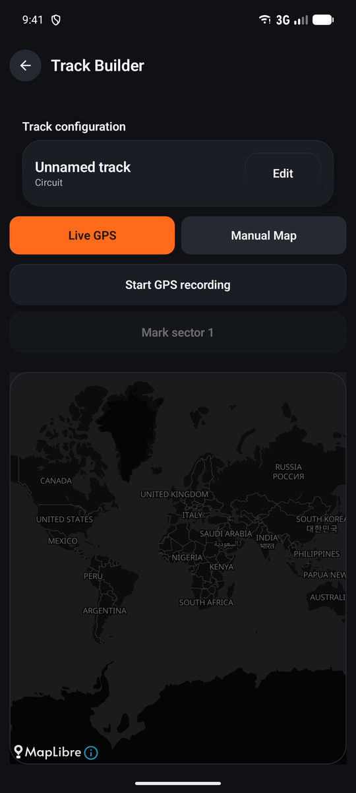
